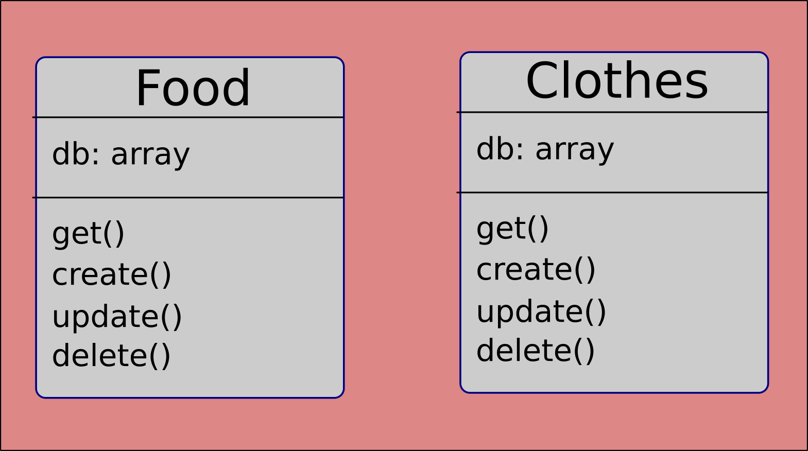

# basic-api-server

A simple API server with tow routers and two models (Food and Clothes) with tests.

- [Submission Pull Request](https://github.com/401-js-WesamAlmasri/basic-api-server/pulls/1)
- [Tests](https://github.com/401-js-WesamAlmasri/basic-api-server/actions)
- [Deployed url](https://bsc-api-ser.herokuapp.com/)

## Setup

`.env Requierments`
    - `PORT`

## Running the app

1. clone the repo.
2. Enter the command `npm start`
3. Endpoints
   1. `/api/v1/food`
       - method : POST
          - create a new food record
       - method : Get
         - get all food records
   2. `/api/v1/food/:id`
       - method : PUT
          - update the food record with the id
       - method : DELETE
         - delete the food record with the id
   3. `/api/v1/clothes`
       - method : POST
          - create a new cloth record
       - method : Get
         - get all clothes records
   4. `/api/v1/clothes/:id`
       - method : PUT
          - update the cloth record with the id
       - method : DELETE
         - delete the cloth record with the id

4. Test
   - Unit Tests: run the command `npm run test`
   - Lint Tests: run the command `npm run lin`

## UML

Class UML Diagram

